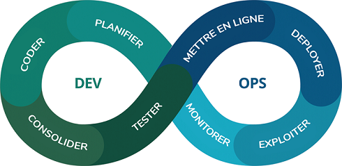
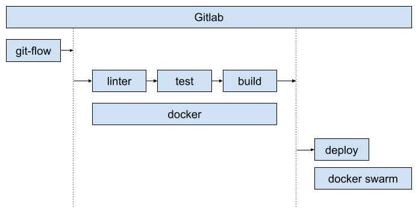
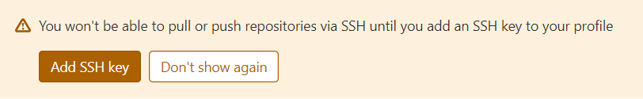

<!-- page_number: true -->
<!-- footer: Intégration continue (CI) et déploiement continu (CD) -->

Intégration continue (CI) et déploiement continu (CD)
===


Source de l'illustration : nemesis-studio.com

##### Mise en pratique CI-CD sous Gitlab

###### par [Fabien Barbaud](fabien.barbaud@timeonegroup.com) - [@BarbaudFabien](https://twitter.com/BarbaudFabien)

---

# Intégration continue

*Continuous integration*

L'**intégration continue** est un ensemble de pratiques utilisées en génie logiciel consistant **à vérifier** à chaque **modification de code source** que le résultat des modifications ne produit **pas de régression** dans l'application développée.

[Wikipedia](https://fr.wikipedia.org/wiki/Int%C3%A9gration_continue)

---

# Déploiement continu

Le **déploiement continu** ou *Continuous deployment* (CD) en anglais, est une approche d'ingénierie logicielle dans laquelle les fonctionnalités logicielles sont **livrées fréquemment** par le biais de **déploiements automatisés**.

[Wikipedia](https://fr.wikipedia.org/wiki/D%C3%A9ploiement_continu)

---

# Notre objectif :



---

# Docker Swarm


[Orchestrateur](https://fr.wikipedia.org/wiki/Orchestration_informatique) [Docker](https://docs.docker.com/get-started/swarm-deploy/)

```bash
$ docker swarm init
```

---

# Gitlab


**GitLab** est un **logiciel libre** de **forge** basé sur git proposant les fonctionnalités de wiki, un système de suivi des bugs, **l’intégration continue et la livraison continue**.

[Wikipedia](https://fr.wikipedia.org/wiki/GitLab)

---

# Gitlab

```bash
$ git clone https://github.com/fabienbarbaud/gitlab-docker.git
$ cd gitlab-docker
$ docker stack deploy --compose-file docker-compose.yml gitlab
```

```bash
$ docker service ls
```

http://localhost
u: `root`
p: `MySuperSecretAndSecurePass0rd!`

---

# Gitlab


http://localhost/-/profile/keys
http://localhost/help/ssh/README#generate-an-ssh-key-pair

```bash
$ ssh git@localhost
```

---

# Gitlab

- Créer un premier projet "test" - http://localhost/root/test
- Cloner ce projet sur votre poste
- Faire un premier commit
- Un push

---

# git-flow

Le workflow Gitflow définit **un modèle de création de branche strict** conçu autour de la **livraison de projet**. Cela fournit un **framework** solide pour la gestion de projets plus importants.

[Atlassian](https://www.atlassian.com/fr/git/tutorials/comparing-workflows/gitflow-workflow)

---

# git-flow

## Branches develop et master


---

# git-flow

## Branche feature


---

# git-flow

## Branche release


---

# git-flow

## Branche hotfix


---

# git-flow

## Les commandes

```bash
$ git flow init
$ git flow feature start ma-feature
$ git flow finish -p
$ git flow release start 0.1.0
$ git flow finish -p
$ git flow hotfix start 0.1.1
$ git flow finish -p
```

---

# Linter

## Outils d'analyse statique

- Javascript : ESLint
- PHP : PHPLint, PHPStan
- Python : pylint

---

# Test unitaire

En programmation informatique, le test unitaire (ou « T.U. », ou « U.T. » en anglais) est une procédure permettant de **vérifier** le bon **fonctionnement** d'une **partie précise** d'un logiciel ou d'une **portion d'un programme** (appelée « unité » ou « module »).

[Wikipedia](https://fr.wikipedia.org/wiki/Test_unitaire)

---

# Test fonctionnel

Les tests fonctionnels sont destinés à s’assurer que, **dans le contexte d’utilisation réelle**, le comportement fonctionnel obtenu est **bien conforme** avec celui attendu.

Un test fonctionnel a donc pour objectif de **dérouler un scénario** composé d’une liste d’actions, et pour chaque action d’effectuer une **liste de vérifications** validant la conformité de l’exigence avec l’attendu.

[Qu’est-ce qu’un test fonctionnel ?
](https://horustest.io/blog/definition-test-fonctionnel/)

---

# Un exemple sur un app Python : Flaskex

## L'app Flaskex

```bash
$ git clone https://github.com/fabienbarbaud/flaskex
$ cd flaskex
$ docker-compose up app
```

http://localhost:5000

---

# Un exemple sur un app Python : Flaskex

## Le linter

```bash
$ docker-compose up linter
```

---

# Un exemple sur un app Python : Flaskex

## Les tests

```bash
$ docker-compose up test
```

---

```
bash-5.0# gitlab-runner register
Runtime platform                                    arch=amd64 os=linux pid=28 revision=2ebc4dc4 version=13.9.0
Running in system-mode.

Enter the GitLab instance URL (for example, https://gitlab.com/):
http://gitlab_gitlab
Enter the registration token:
njsxZN7dwq3_tqcxwRMA
Enter a description for the runner:
[bd97c11ac68a]:
Enter tags for the runner (comma-separated):

Registering runner... succeeded                     runner=njsxZN7d
Enter an executor: virtualbox, docker+machine, docker-ssh+machine, kubernetes, ssh, custom, docker, docker-ssh, parallels, shell:
docker
Enter the default Docker image (for example, ruby:2.6):
pyhton
Runner registered successfully. Feel free to start it, but if it's running already the config should be automatically reloaded!
```